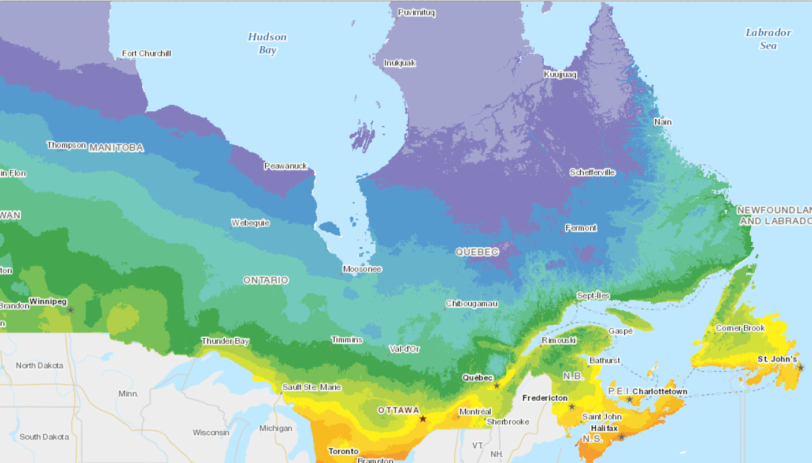
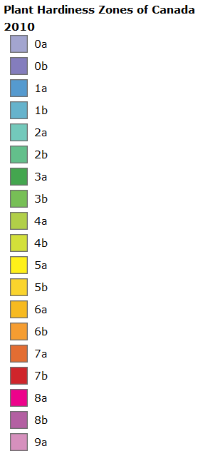

# Land Real Estate Program
Proof of concept, base code: data pipeline, cleanup, exploration, analysis.

I want to buy land in the boreal forest but no website can answer my questions:

- I want good current data on the market to make informed decisions;
- I want to be able to compare listings side by side;
- I want to query the data, I dont want to endlessly check on very basic webpages;
- I want to find anomalies in the market to benefit from;
- I want to know which properties are in a positive cashflow where applicable;
- I want to study which factors are i fluencing the price;
- I want to know which proportion on listings say they are "rare" opportunities;
- I want to know what is the average price per square foot on a given region;
- I want to know what is the impact of dis5ance from greater montreal on the pruce
- Trouver des proprietes qui seraient sous-evaluees;
- Sur une propriete evaluer sont prix 'fair' selon mes caracteristiques;

The website I've checked has nothing of the sort. So I made a scraper to get the data. And then I augmented it with other data sources.

## Web scraper 'List' and 'Detail'

The web scraping is done in multiple parts.

First I get the listing of all land for sale which provide me with basic info (area,price,town) AND the links for each listing. Then I scrape each individual listing to get the detailed information.

I started with `bs4`, but could not get the page to switch because there are no page numbers in the URL of the website. I learned `Selenium` from scratch. First I wanted to use `Selenium` only for page switching thus reusing what I already developed but the `driver.page_source` method seems to truncate the page and I consistently got only 12 results instead of the 20 per pages I was suposed to get.

### Methodology

1. Connect to the website (url include land properties only)
2. Get the number of pages for the loop
3. Get the data and the link for the 20 properties on the page
4. Do this for all the pages
5. Write the data to disk (Excel)
6. Add other sources

*Got the data from 453 pages to analyze 9061 properties.*

# Data augmentations

## Centris Listing + Details
Some data used to augment the original data from Centris:

| Data Source | Description | How to get | Purpose |
| ----------- | ----------- | ---------- | ------- |
| Centris Listing | List of land properties for sale | Webscraping Centris.ca | Get the link to obtain details |
| Centris Details | Details about each properies | Webscraping Centris.ca | Main data, target of the operation |
| Google Map Distance Matrix API | Query Gmap to get the distance/time to reach the destination. | Google Map API | Multiple |
| Google Map Geolocalisation API | Query Gmap to get the coordinate and other data about location. | Google Map API | Multiple |
| Canada Plant Hardiness Zone    | Describe zones where specific plants are likely to live | Government | Homesteading, Permaculture |
| 2016 Census Canada| Information about demographics per region/city | Government | Economic analysis |
| Cartographie hydrogéologique QC | Information about subteranean water source | Government | Building well, economic |
| Meteo | Average temp. per month | Unknown yet | Comparison |
| Geological data | Soil composition | Unknown yet | Agriculture, architecture, mining |

- Need to extract data from Centris to create a string that will be used to query Gmaps API. Such as: "City, Prov H0H 0H0"
- From there, Gmap will provide coordinates which can be used to link data with other sources.
- Keys can be: postal code, adress, city (census), coordinate (hardiness, cartography), centris unique number

## Google map 'Distance Matrix API'

## Google map 'Geolocalization API'

## Plant hardiness zones

# Data Cleanup

# Analysis

Un debut d'analyse ici: [CLICK](https://github.com/abouchard-ds/Land-Real-Estate/blob/master/Data_Analysis.ipynb).

- Factors most contributing to the price;
- What's the impact of distance from Montreal on the price (hypothesis: farther = cheaper);
- Heatmap of avg. price per square/foot;
- Listing land that are under 2h from home, with low prices (<= 2$ sq/ft);
- Analysis of prices per region;
- Which region have more/less land for sale;
- Clustering of price with analysis;
- Regression on the price;

# ML

Regression pour savoir le prix que devrais etre un terrain.
